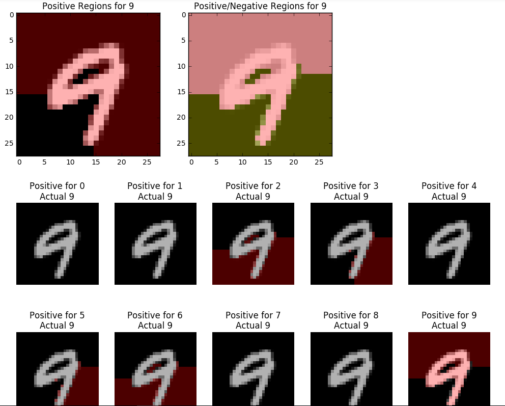

# Observations

## Dataset
MNIST is too simple in terms of pattern (images of digit from 0 to 9) that there is no significant change in determining the factors contributing to the prediction when number of sampling in LIME increases. Thus, for this kind of dataset, 1000 samplings per prediction is adequate.

## LIME
Local Interpretable Model-agnostic Explanation is a model trying to interprete the result of any complex machine learning technique in a comprehensive manner such that end-users (non-expert) can understand by themselves. Previous approaches try to capture how input influences prediction by observing over all data points. However, this model believed that in order to truly interprete the decision making process, each data point is unique and has its own reasoning which can not be made to be general for other similar (different in one feature, for instance) data points.  

Imagine the representation of true distribution of data points is extremely complex and curved. Let's take a magnifier and zoom in a particular point. Now you can find at least one straight line to divide the feature space (limited by the visionary zone of magnifier) into two sets: positive and negative points. This is the core notion of LIME, and by sampling datapoints nearby by disturbing features with a predefined distribution, one could gain enough data to train a simple classifier (decision tree for instance), and thus can explain the output of prediction. 

An example of LIME, with input is an image and output is the influence of each possible class contributing in the final prediction. Due to simple characteristic of dataset, it is still not clear why some pixels belong to digit 3 and some belong to 9 instead.

## Experiment
With aforementioned dataset, number of iterations (the number of times to do backpropagation) is 2000 for every model. I found this number is enough to reach an accuracy  for every model.
### Model 1: Neural Network with no hidden layer
- Architecture: (input layer(28\*28) \* weight) -> softmax -> output layer(10)
- The plot of weight seems to be randomly uniform, there is no clear patter suggests a correlation to any digits from 0 to 9. 

It is no doubt that the image after being processed via this filter (weight) would be saturated into random as well, hence my guess for its yet powerful prediction is the difference in mean of weight set for each digit. The weights in below image are different from each other because they were retrained, however the color bandwidth show similar color distribution. Which leads to the conclusion that they make prediction by training the mean weight to be in some particular range of value. Note that the weight of 0 has a tiny circle in the center which can give a hint somehow it captures the shape of digit 0, however no more obvious evidence in the others. 
 

### Model 2: Neural Network with 2 hidden layers
- Architecture: (input layer(28\*28) \* weight) -> sigmoid -> (hidden layer(100) \* weight) -> softmax -> output layer(10)
- Similar observations were made and randomness exists in trained weights. The only difference is a new weight set and layer were added into previous model. Below is image showing the plot of hidden layer, which is expected to give a hint of higher abstract level of digit itself, turned out to be random as well. 

- Yet the new hidden layer seems to be meaningless, I still apply LIME on it to see whether it makes difference. Apparently, it shows no promising result.

### Model 3: Neural Network with 3 hidden layers
- Architecture: (input layer(28\*28) \* weight) -> sigmoid -> (hidden layer(100) \* weight) -> sigmoid -> (hidden layer(49) \* weight)-> softmax -> output layer(10)
- No additional observation. For seeing example from LIME as in above models, check [here](https://github.com/hovinh/MNIST_NeuralNet_Transparency/blob/mnist_neuralnet_lime/MNIST_Neural%20Network.ipynb) .  

## Conclusion
This is a first attempt to observe how LIME works on a typical dataset, namely, MNIST along with a typical machine learning technique, Fully Connected Neural Network. Despite the fact that the model works pretty well and LIME can show how much each digits contribute to the final prediction, providing explanations yet seem unsatisfied to me. On the bright side, we can now cross out Neural Network from our to-do-list, and look forward doing new things with more promissing architecture such as Convolutional Neural Network. Other things are worth to note:
- Try new data set, especially the "Typical" one(update later when I've found the original paper). 
- Any idea or comment?
